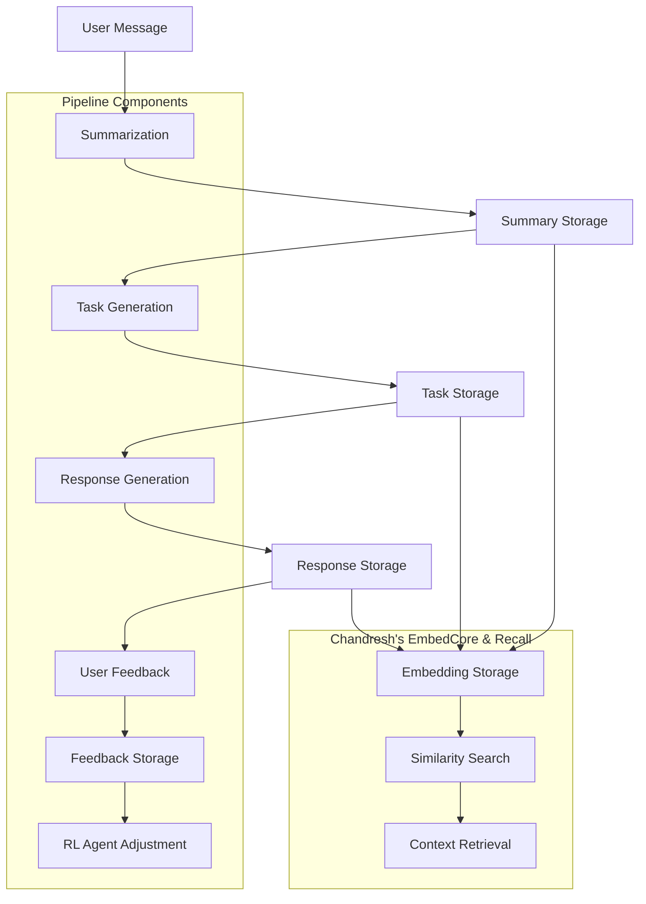

# AI Assistant Pipeline API Documentation

This document provides comprehensive documentation for the AI Assistant Pipeline API, including all endpoints, request/response schemas, and integration details.

## Table of Contents
1. [Overview](#overview)
2. [API Endpoints](#api-endpoints)
3. [Data Models](#data-models)
4. [Pipeline Flow](#pipeline-flow)
5. [Integration Points](#integration-points)
6. [Error Handling](#error-handling)
7. [Configuration](#configuration)
8. [Metrics and Monitoring](#metrics-and-monitoring)

## Overview

The AI Assistant Pipeline API provides a complete end-to-end flow for processing user messages through summarization, task generation, and feedback collection. It integrates with Chandresh's EmbedCore & Recall functionality for semantic similarity search.

## API Endpoints

### Pipeline Endpoints

#### POST /api/summarize
Generate a summary from a user message.

**Request:**
```json
{
  "message_text": "string",
  "user_id": "string (optional)"
}
```

**Response:**
```json
{
  "summary_id": "string",
  "summary_text": "string",
  "confidence_score": "number (0.0-1.0)",
  "timestamp": "string (ISO 8601)"
}
```

**Example:**
```bash
curl -X POST "http://localhost:8001/api/summarize" \
  -H "Content-Type: application/json" \
  -d '{"message_text": "I need help booking a hotel room", "user_id": "user123"}'
```

#### POST /api/process_summary
Process a summary to generate actionable tasks.

**Request:**
```json
{
  "summary_id": "string",
  "user_id": "string (optional)"
}
```

**Response:**
```json
{
  "task_id": "string",
  "task_text": "string",
  "priority": "string (low|medium|high)",
  "confidence_score": "number (0.0-1.0)",
  "timestamp": "string (ISO 8601)"
}
```

#### POST /api/feedback
Submit feedback for a summary, task, or response.

**Request:**
```json
{
  "summary_id": "string",
  "task_id": "string (optional)",
  "response_id": "string (optional)",
  "score": "integer (1 for thumbs up, -1 for thumbs down)",
  "comment": "string (optional)"
}
```

**Response:**
```json
{
  "status": "string",
  "message": "string",
  "timestamp": "string (ISO 8601)"
}
```

### Configuration Endpoints

#### GET /api/pipeline/config
Get current pipeline configuration.

**Response:**
```json
{
  "enable_summarization": "boolean",
  "enable_task_generation": "boolean",
  "enable_embedding_storage": "boolean",
  "retry_attempts": "integer",
  "timeout_seconds": "integer"
}
```

#### PUT /api/pipeline/config
Update pipeline configuration.

**Request:**
```json
{
  "enable_summarization": "boolean",
  "enable_task_generation": "boolean",
  "enable_embedding_storage": "boolean",
  "retry_attempts": "integer",
  "timeout_seconds": "integer"
}
```

### Metrics Endpoints

#### GET /api/metrics/summary
Get pipeline performance metrics.

**Response:**
```json
{
  "summaries_processed": "integer",
  "tasks_generated": "integer",
  "feedback_received": "integer",
  "embeddings_stored": "integer",
  "average_feedback_score": "number",
  "feedback_distribution": "object",
  "timestamp": "string (ISO 8601)"
}
```

### Chandresh's EmbedCore & Recall Endpoints

#### POST /api/search_similar
Search for similar items using semantic similarity.

**Request:**
```json
{
  "summary_id": "string (optional)",
  "message_text": "string (optional)",
  "top_k": "integer (optional, default: 3)"
}
```

**Response:**
```json
{
  "related": [
    {
      "item_type": "string (summary|task|response)",
      "item_id": "string",
      "score": "number (0.0-1.0)",
      "text": "string"
    }
  ],
  "query_type": "string (summary_id|message_text)",
  "total_found": "integer"
}
```

#### POST /api/store_embedding
Manually store embeddings (used for integration).

**Request Parameters:**
- item_type: string
- item_id: string
- text: string

**Response:**
```json
{
  "status": "string",
  "message": "string"
}
```

#### GET /api/embeddings/stats
Get statistics about stored embeddings.

**Response:**
```json
{
  "total_embeddings": "integer",
  "by_type": "object",
  "service_status": "string"
}
```

#### POST /api/reindex
Trigger reindexing of all summaries and tasks.

**Response:**
```json
{
  "status": "string",
  "summaries_indexed": "integer",
  "tasks_indexed": "integer",
  "total_indexed": "integer"
}
```

## Data Models

### Summary
```json
{
  "summary_id": "string (primary key)",
  "user_id": "string",
  "message_text": "string",
  "summary_text": "string",
  "timestamp": "string (ISO 8601)"
}
```

### Task
```json
{
  "task_id": "string (primary key)",
  "summary_id": "string (foreign key)",
  "user_id": "string",
  "task_text": "string",
  "priority": "string (low|medium|high)",
  "timestamp": "string (ISO 8601)"
}
```

### Response
```json
{
  "response_id": "string (primary key)",
  "task_id": "string (foreign key)",
  "user_id": "string",
  "response_text": "string",
  "tone": "string",
  "status": "string",
  "timestamp": "string (ISO 8601)"
}
```

### Feedback
```json
{
  "id": "integer (primary key)",
  "summary_id": "string",
  "task_id": "string",
  "response_id": "string",
  "score": "integer (1 or -1)",
  "comment": "string",
  "timestamp": "string (ISO 8601)"
}
```

### Embedding
```json
{
  "id": "integer (primary key)",
  "item_type": "string (summary|task|response)",
  "item_id": "string",
  "vector_blob": "string (JSON-encoded vector)",
  "timestamp": "string (ISO 8601)"
}
```

## Pipeline Flow



## Integration Points

### With Seeya (Summarizer)
- The `/api/summarize` endpoint provides the same functionality as Seeya's summarize endpoint
- Automatically stores embeddings for generated summaries when enabled

### With Sankalp (Task Engine)
- The `/api/process_summary` endpoint processes summaries to generate tasks
- Automatically stores embeddings for generated tasks when enabled

### With Noopur (Response Generator)
- Integrates with response generation through task IDs
- Stores embeddings for generated responses when enabled

### With Parth (Coach Feedback)
- The `/api/feedback` endpoint stores user feedback
- Feeds into RL agent for behavior adjustment

### With Nilesh (Metrics)
- The `/api/metrics/summary` endpoint provides performance metrics
- Logs latency and error rates for monitoring

## Error Handling

All endpoints follow standard HTTP status codes:
- 200: Success
- 400: Bad Request (invalid input)
- 404: Not Found (resource not found)
- 500: Internal Server Error (unexpected error)

Error responses follow this format:
```json
{
  "detail": "string (error message)"
}
```

### Retry Logic
Endpoints implement exponential backoff retry logic:
- Max retries: 3 attempts
- Backoff: 0.1s, 0.2s, 0.4s

### Timeout Handling
- Default timeout: 30 seconds
- Configurable through pipeline configuration

## Configuration

The pipeline can be configured through the `/api/pipeline/config` endpoints:

| Setting | Default | Description |
|---------|---------|-------------|
| enable_summarization | true | Enable/disable summarization stage |
| enable_task_generation | true | Enable/disable task generation stage |
| enable_embedding_storage | true | Enable/disable embedding storage |
| retry_attempts | 3 | Number of retry attempts for failed operations |
| timeout_seconds | 30 | Timeout for operations in seconds |

## Metrics and Monitoring

### Key Metrics Tracked
1. **Processing Volume**: Summaries processed, tasks generated
2. **Quality Metrics**: Average confidence scores, feedback scores
3. **Performance**: Latency, error rates
4. **User Engagement**: Feedback submission rate

### Monitoring Endpoints
- `/health`: Basic health check
- `/api/embeddings/stats`: Embedding service statistics
- `/api/metrics/summary`: Comprehensive pipeline metrics

### Alerting Thresholds
- Error rate > 5%: Warning
- Error rate > 10%: Critical
- Latency > 5s: Warning
- Latency > 10s: Critical

## Sample Usage Flow

### 1. Process a User Message
```bash
# Summarize the message
curl -X POST "http://localhost:8001/api/summarize" \
  -H "Content-Type: application/json" \
  -d '{"message_text": "I need to book a flight to New York next week", "user_id": "user123"}'

# Process the summary to generate tasks
curl -X POST "http://localhost:8001/api/process_summary" \
  -H "Content-Type: application/json" \
  -d '{"summary_id": "s12345", "user_id": "user123"}'
```

### 2. Submit Feedback
```bash
# Submit positive feedback
curl -X POST "http://localhost:8001/api/feedback" \
  -H "Content-Type: application/json" \
  -d '{"summary_id": "s12345", "task_id": "t67890", "score": 1, "comment": "Great task!"}'
```

### 3. Find Similar Context
```bash
# Search for similar items
curl -X POST "http://localhost:8000/api/search_similar" \
  -H "Content-Type: application/json" \
  -d '{"message_text": "flight booking to New York", "top_k": 3}'
```

## API Versioning

Current version: v1.0.0

Versioning follows Semantic Versioning 2.0.0:
- MAJOR version for incompatible API changes
- MINOR version for backward-compatible functionality
- PATCH version for backward-compatible bug fixes

## Security Considerations

- All endpoints use HTTPS in production
- Input validation for all parameters
- Rate limiting to prevent abuse
- Authentication/authorization for production deployment

## Performance Guidelines

- Keep message texts under 1000 characters for optimal performance
- Use appropriate top_k values (1-10) for similarity search
- Batch operations when processing multiple items