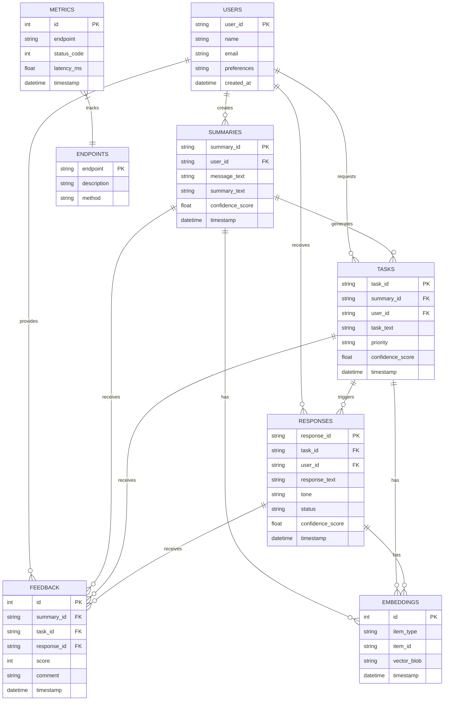
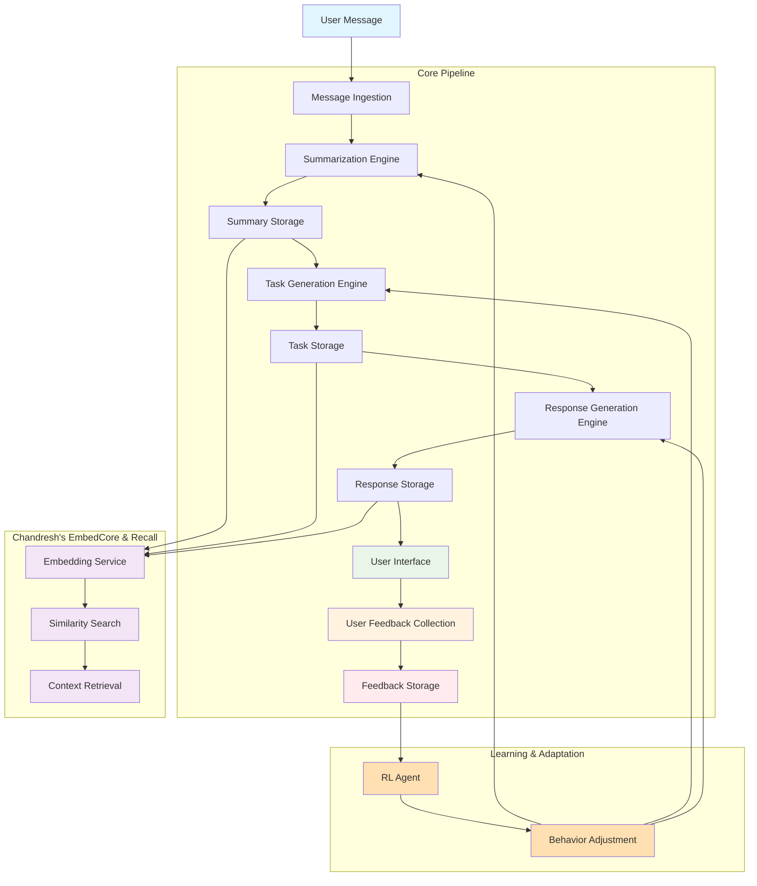
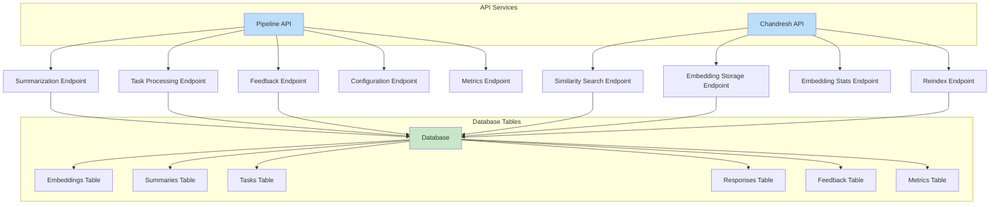
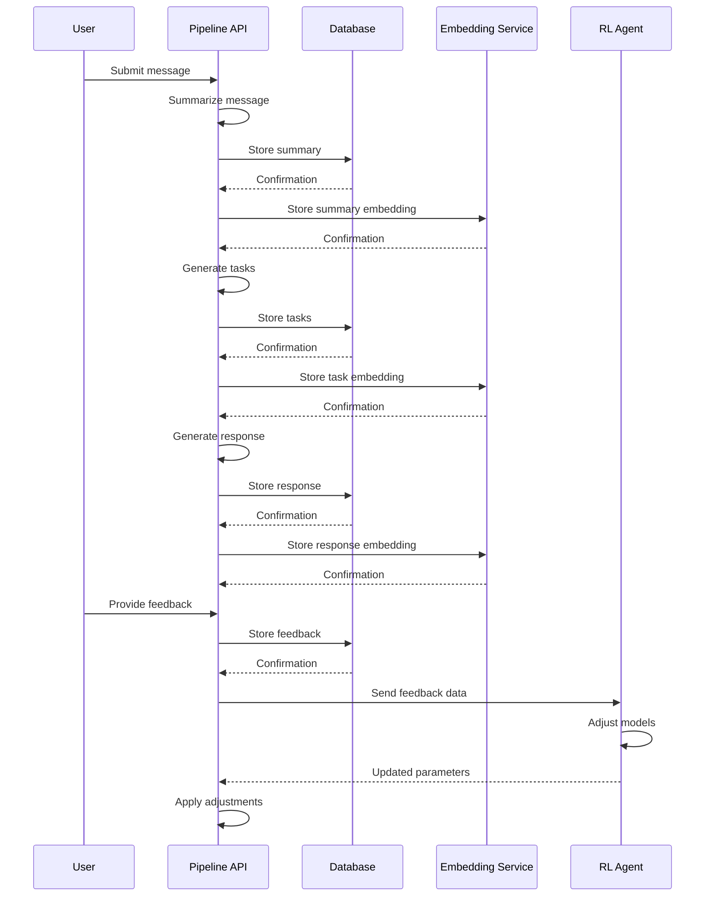
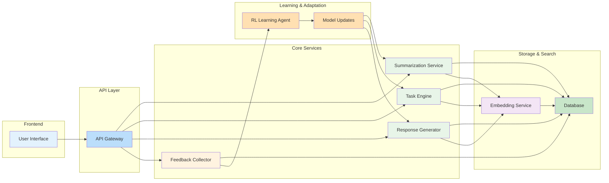

# Database Schema Diagrams

This document provides visual representations of the database schema used in the AI Assistant system.

## Entity Relationship Diagram

## Pipeline Flow Diagram

## API Endpoint Relationships

## Data Flow Through System

## Component Interaction Map

